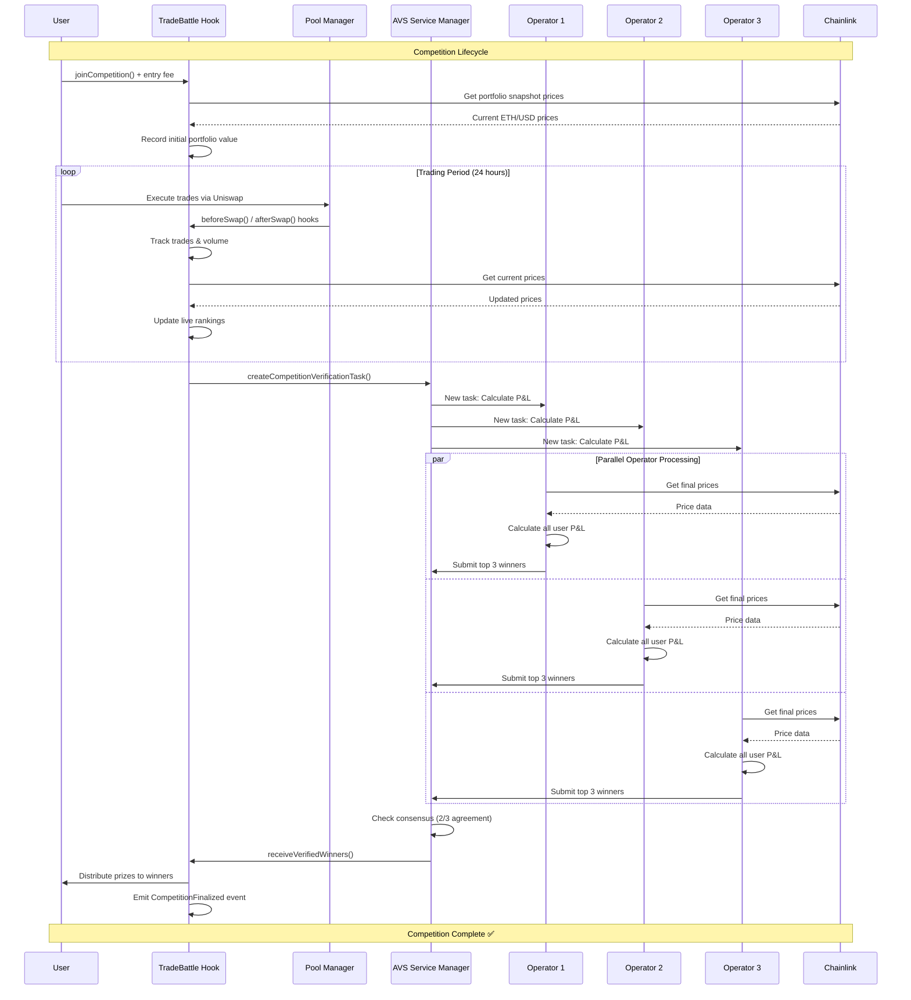
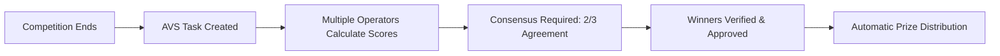

EigenLayer AVS Code - https://github.com/yashj09/Eigenlayer-AVS-UniswapV4

# 🎮 TradeBattle - Competitive Trading on Uniswap v4

**Transform DeFi trading into competitive gaming experiences with real prizes and live leaderboards.**

TradeBattle is a Uniswap v4 hook that automatically turns every trade into a competitive scoring experience. Users join daily tournaments, compete for real prize pools, and build trading reputations - all while trading normally through Uniswap.

## 🌟 What is TradeBattle?

TradeBattle transforms regular DeFi trading into engaging competitions where:

- **Pay to Play**: Users pay entry fees ($10-50) to join daily trading tournaments
- **Trade Normally**: Use any Uniswap interface - the hook tracks performance automatically  
- **Win Real Prizes**: Top performers split prize pools based on trading performance
- **Trustless Verification**: EigenLayer AVS ensures fair scoring with cryptoeconomic security
- **Live Competition**: Real-time leaderboards and portfolio tracking
- **Build Reputation**: Earn achievement NFTs and climbing ranking systems

## 🚀 Quick Start

### Current Deployment (Sepolia Testnet)

```bash
Hook Address: 0x30855F7bA0105515CC9C383eF46E09A7ea7A15d0
Link - https://sepolia.etherscan.io/address/0x30855F7bA0105515CC9C383eF46E09A7ea7A15d0
Network: Sepolia Testnet
Status: Live & Functional ✅
```


## 🏆 Competition Mechanics

### Daily Profit Challenge (Current Implementation)

**How It Works:**
- 24-hour competitions starting daily
- Entry fee: $10 USD (dynamically calculated in ETH)
- Goal: Achieve highest portfolio percentage return
- Minimum requirements: 2+ trades, $100+ volume

**Prize Distribution:**
- 🥇 **1st Place**: 70% of prize pool
- 🥈 **2nd Place**: 20% of prize pool  
- 🥉 **3rd Place**: 10% of prize pool
- 💰 **Platform Fee**: 10% for development

**Entry Requirements:**
- Portfolio value ≥ $50 USD
- Complete ≥ 2 trades during competition
- Generate ≥ $100 USD trading volume

### Premium Competitions

**WETH/USDC Pools:**
- Higher entry fee: $50 USD
- Larger prize pools
- Enhanced LP rewards
- Stricter qualification requirements

## 📊 How Scoring Works

### Portfolio Tracking
1. **Snapshot**: Complete portfolio value captured at competition start
2. **Real-time Pricing**: Chainlink price feeds for accurate valuations
3. **P&L Calculation**: `(final_value - initial_value) / initial_value * 100`
4. **Live Rankings**: Continuous leaderboard updates during competition

### Anti-Gaming Measures
- Prevent mid-competition deposits
- Detect wash trading patterns
- Minimum trading requirements
- Behavioral analysis (roadmap)

## 🛠 Technical Architecture

### System Overview


### Competition Verification Flow



### Uniswap v4 Hook Integration

```solidity
contract TradeBattleHook is BaseHook {
    // Hook implementations
    function beforeSwap() -> Track user entries
    function afterSwap() -> Update portfolio & volume stats  
    function afterAddLiquidity() -> LP competition tracking
    function afterDonate() -> Distribute LP rewards
}
```

### EigenLayer AVS - Decentralized Score Verification 🔒

**Why EigenLayer AVS?**
Traditional DeFi lacks trust in competition scoring. Anyone could manipulate results or dispute winners. TradeBattle solves this with **cryptoeconomic security** through EigenLayer's restaking infrastructure.

**How It Works:**


**The Process:**
1. **Competition Ends** → Hook calls `createCompetitionVerificationTask()`
2. **Operators Calculate** → Multiple staked validators independently compute P&L for all participants  
3. **Consensus Mechanism** → 2/3 of operators must agree on top 3 winners
4. **Verification Complete** → AVS calls back `receiveVerifiedWinners()` on hook
5. **Automatic Payouts** → Winners receive ETH prizes immediately

**Security Benefits:**
- **🛡️ Anti-Cheat Protection**: Multiple independent verifications prevent manipulation
- **💰 Economic Stakes**: Operators lose staked ETH if they approve wrong results  
- **⚡ Scalable Computation**: Complex scoring runs off-chain without gas limits
- **🤖 Trustless Automation**: No human intervention needed for prize distribution

**Current Status**: ✅ AVS implementation ready

### Key Features Implemented

✅ **Real Price Feeds**: Chainlink ETH/USD on Sepolia  
✅ **Dynamic Entry Fees**: USD amounts converted to ETH  
✅ **Portfolio Tracking**: Complete token balance snapshots  
✅ **Competition Management**: Create, join, finalize competitions  
✅ **Prize Distribution**: Automatic winner payouts  
✅ **LP Incentives**: Liquidity provider stickiness rewards  
✅ **EigenLayer AVS**: Decentralized score verification (testing)

### Architecture Components

- **TradeBattleHook.sol**: Main hook contract with competition logic
- **UniCompeteAVS**: EigenLayer service for trustless score verification
- **NetworkConfig.sol**: Multi-network configuration (Sepolia, Mainnet ready)  
- **Price Feeds**: Real Chainlink oracles (no mocks)
- **Competition Engine**: Entry, tracking, and payout systems

## 🚀 Deployment Guide

### Environment Setup

```bash
# Required environment variables
export PRIVATE_KEY=0x1234567890abcdef...
export SEPOLIA_RPC_URL=https://rpc.sepolia.org

# Optional: Use existing hook
export DEPLOYED_HOOK_ADDRESS=0x30855F7bA0105515CC9C383eF46E09A7ea7A15d0
```

### Deploy on Sepolia

```bash
# Deploy new hook with mining
forge script script/DeployUniCompeteHook.sol:DeployUniCompeteHook \
  --rpc-url $SEPOLIA_RPC_URL \
  --private-key $PRIVATE_KEY \
  --broadcast \
  --verify

# Create first competition
forge script script/CreateCompetition.s.sol:CreateCompetition \
  --rpc-url $SEPOLIA_RPC_URL \
  --private-key $PRIVATE_KEY \
  --broadcast

# Test competition functions  
forge script script/TestCompetitions.sol:TestCompetitions \
  --rpc-url $SEPOLIA_RPC_URL \
  --private-key $PRIVATE_KEY \
  --broadcast
```

### Project Structure

```
src/
├── UniCompeteHook.sol           # Main hook contract
├── interfaces/
│   └── IUniCompete.sol         # Hook interface
└── utils/
    └── HookMiner.sol           # Address mining utility

script/
├── DeployUniCompeteHook.sol    # Deployment script
├── CreateCompetition.s.sol     # Competition creation
├── TestCompetitions.sol        # Testing utilities
└── NetworkConfig.sol           # Network configurations

test/
├── Counter.t.sol               # Hook testing framework  
└── utils/                      # Test utilities and helpers
```

## 🎯 Current Status & Roadmap

### ✅ Completed (v1.0)
- Core competition mechanics
- Portfolio tracking with real price feeds  
- Entry fee collection and prize distribution
- LP stickiness rewards system
- Sepolia testnet deployment
- **EigenLayer AVS implementation** for decentralized score verification

### 🚧 In Progress (v1.1)
- EigenLayer AVS integration testing and deployment
- Advanced anti-cheat detection algorithms
- Multiple competition types (volume wars, consistency challenges)
- Achievement NFT system

### 🔮 Future Features (v2.0)
- Cross-chain competitions
- Team-based tournaments  
- Prediction markets integration
- Social features and leaderboards
- Mobile app with push notifications

## 🔧 Configuration

### Network Support

| Network | Status | Pool Manager | WETH | USDC |
|---------|--------|--------------|------|------|
| Sepolia | ✅ Live | `0x8C4BcBE6b9eF47855f97E675296FA3F6fafa5F1A` | `0x7b79995e5f793A07Bc00c21412e50Ecae098E7f9` | `0x1c7D4B196Cb0C7B01d743Fbc6116a902379C7238` |
| Mainnet | 🚧 Ready | TBD | `0xC02aaA39b223FE8D0A0e5C4F27eAD9083C756Cc2` | `0xa0b86a33E6441d1e7c91aE0C63C4E79F2a5a7fB6` |
| Arbitrum | 🚧 Ready | TBD | `0x82aF49447D8a07e3bd95BD0d56f35241523fBab1` | `0xaf88d065e77c8cC2239327C5EDb3A432268e5831` |
| Base | 🚧 Ready | TBD | `0x4200000000000000000000000000000000000006` | `0x833589fCD6eDb6E08f4c7C32D4f71b54bdA02913` |

### Price Feeds (Chainlink)

- **Sepolia ETH/USD**: `0x694AA1769357215DE4FAC081bf1f309aDC325306`
- **Mainnet ETH/USD**: `0x5f4eC3Df9cbd43714FE2740f5E3616155c5b8419`
- All networks use real Chainlink oracles (no mocks)

## 📝 Usage Examples

### Create a Competition

```solidity
// Create daily WETH/USDC competition
PoolKey memory poolKey = PoolKey({
    currency0: Currency.wrap(WETH),
    currency1: Currency.wrap(USDC), 
    fee: 3000,
    tickSpacing: 60,
    hooks: IHooks(hookAddress)
});

hook.createDailyCompetition(poolKey);
```

### Join as Trader

```solidity
// Join with entry fee
uint256 competitionId = 1;
uint256 entryFee = hook.getCompetitionInfo(competitionId).entryFee;

hook.joinCompetition{value: entryFee}(competitionId);
```

### Join as LP

```solidity
// Join as liquidity provider
hook.joinCompetitionAsLP(competitionId);
```
